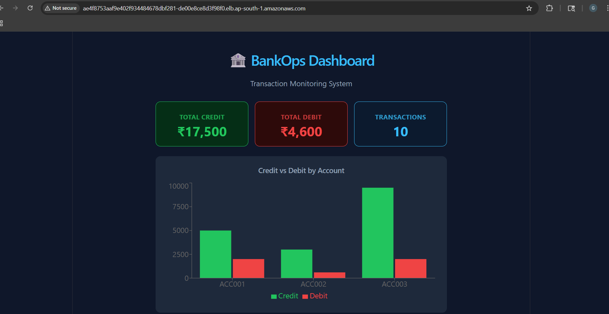
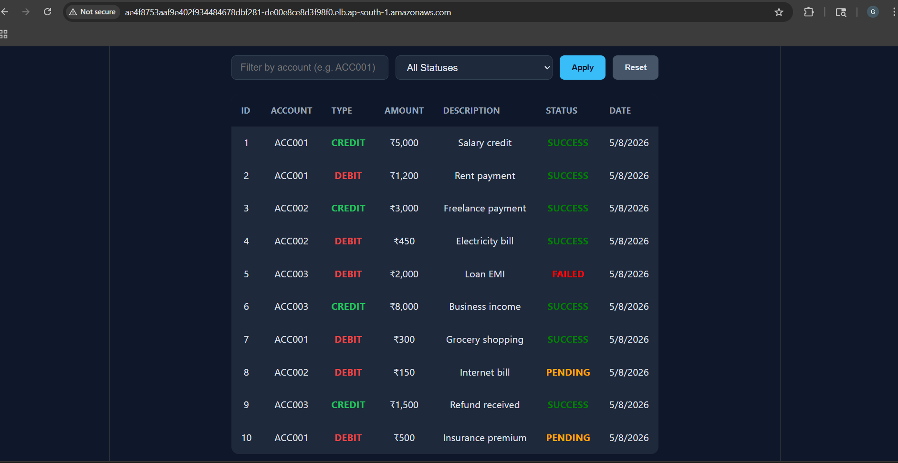
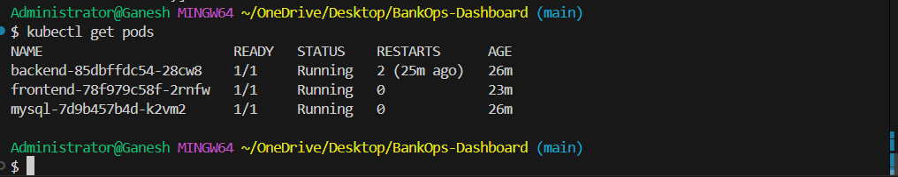
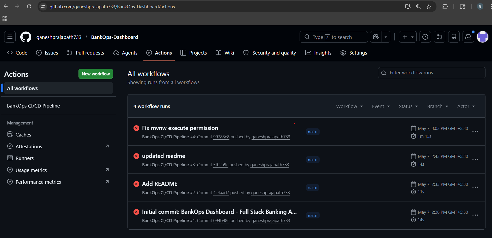

# 🏦 BankOps Dashboard

A full-stack **Transaction Monitoring Dashboard** built for internal banking operations teams. This project demonstrates a complete software engineering stack — from a Java Spring Boot REST API backend, to a React frontend dashboard, to full Docker containerization and Kubernetes deployment with a CI/CD pipeline.

---

## 📸 Preview

| Summary Cards & Chart | Transaction Table with Filters |
|---|---|
| Total Credit, Debit, and transaction count cards with a bar chart showing Credit vs Debit per account | Filterable table showing all transactions with color-coded type and status |

---

## 🌐 Live Demo

> **Dashboard URL:** http://ae4f8753aaf9e402f934484678dbf281-de00e8ce8d3f98f0.elb.ap-south-1.amazonaws.com
> *(Deployed on AWS EKS — may be offline to avoid costs)*

## 📸 Screenshots

| Live on AWS EKS | Transaction Table |
|---|---|
|  |  |

| Kubernetes Pods | GitHub Actions CI/CD |
|---|---|
|  |  |

---

## 🏗️ Architecture

```
Browser
   │
   ▼
React Frontend (Vite + Recharts)
   │  HTTP requests via Axios
   ▼
Nginx Reverse Proxy (port 80)
   │  /api/* → proxied to backend
   ▼
Spring Boot REST API (port 8080)
   │  JPA/Hibernate ORM
   ▼
MySQL 8.0 Database (port 3306)

All services run in Docker containers, orchestrated via docker-compose locally,
and deployable to AWS EKS via Kubernetes manifests and GitHub Actions CI/CD.
```

---

## 🛠️ Tech Stack

| Layer | Technology | Purpose |
|---|---|---|
| Backend | Java 17, Spring Boot 3.5 | REST API server |
| ORM | Hibernate + Spring Data JPA | Database interaction |
| Build Tool | Maven | Backend dependency management |
| Frontend | React 18, Vite | UI framework |
| Charts | Recharts | Bar chart visualization |
| HTTP Client | Axios | API calls from frontend |
| Styling | Plain CSS | Dashboard styling |
| Database | MySQL 8.0 | Persistent data storage |
| Proxy | Nginx | Serve frontend + proxy API |
| Containers | Docker, Docker Compose | Local containerization |
| Orchestration | Kubernetes (K8s) | Production deployment |
| CI/CD | GitHub Actions | Automated build and deploy |
| Cloud | AWS EKS, ECR | Container registry + K8s cluster |

---

## 📋 Prerequisites

Before you can run this project, you need the following tools installed on your machine.

### 1. Java 17
Used to build and run the Spring Boot backend.

- Download: https://adoptium.net/en-GB/temurin/releases/?version=17
- After installing, verify:
```bash
java -version
# Should show: openjdk version "17.x.x"
```

### 2. Node.js 20
Used to build and run the React frontend.

- Download: https://nodejs.org/en/download
- After installing, verify:
```bash
node -v
# Should show: v20.x.x

npm -v
# Should show: 10.x.x
```

### 3. Docker Desktop
Used to run MySQL in a container and to build/run all services together via docker-compose.

- Download: https://www.docker.com/products/docker-desktop/
- After installing, open Docker Desktop and make sure it is running (whale icon in taskbar)
- Verify:
```bash
docker --version
# Should show: Docker version 24.x.x or higher

docker-compose --version
# Should show: Docker Compose version v2.x.x
```

### 4. Git
Used to clone the repository.

- Download: https://git-scm.com/downloads
- Verify:
```bash
git --version
# Should show: git version 2.x.x
```

---

## 🚀 Getting Started

You have two ways to run this project:

- **Option A** — Docker Compose (recommended, runs everything in one command)
- **Option B** — Run individually (useful for development)

---

## Option A — Run with Docker Compose (Recommended)

This is the easiest way. Docker Compose will start MySQL, the Spring Boot backend, and the React frontend all together automatically.

### Step 1 — Clone the repository
```bash
git clone https://github.com/ganeshprajapath733/BankOps-Dashboard.git
cd BankOps-Dashboard
```

### Step 2 — Make sure Docker Desktop is running
Open Docker Desktop on your machine and wait until it shows "Engine running".

### Step 3 — Start all services
```bash
docker-compose up --build
```

This command will:
- Pull the MySQL 8.0 Docker image
- Build the Spring Boot backend Docker image
- Build the React frontend Docker image
- Start all three services and connect them together
- Auto-create the database table
- Auto-insert 10 sample transactions

**First run takes about 3-5 minutes** because it downloads dependencies. Subsequent runs are faster.

### Step 4 — Open the dashboard
Once you see this in the terminal:
```
bankops-backend  | Started BankopsBackendApplication in x.xxx seconds
bankops-frontend | nginx/1.x.x ready
```

Open your browser and go to:
```
http://localhost:80
```

You should see the BankOps Dashboard with summary cards, a chart, and a transaction table.

### Step 5 — Stop the application
Press `Ctrl + C` in the terminal to stop all services. To remove containers:
```bash
docker-compose down
```

To also remove the database volume (deletes all data):
```bash
docker-compose down -v
```

---

## Option B — Run Services Individually (Development Mode)

Use this if you want to make code changes and see them live.

You will need **3 separate terminal windows** open at the same time.

---

### Terminal 1 — Start MySQL with Docker

```bash
docker run --name bankops-mysql \
  -e MYSQL_ROOT_PASSWORD=bankops123 \
  -e MYSQL_DATABASE=bankopsdb \
  -p 3307:3306 \
  -d mysql:8.0-debian
```

Wait 10-15 seconds for MySQL to be ready. Verify it is running:
```bash
docker ps
# You should see bankops-mysql with STATUS "Up"
```

---

### Terminal 2 — Start the Spring Boot Backend

```bash
cd BankOps-Dashboard/backend/bankops-backend
./mvnw spring-boot:run
```

**On Windows**, if `./mvnw` doesn't work, use:
```bash
mvnw.cmd spring-boot:run
```

Wait for this line to appear:
```
Started BankopsBackendApplication in x.xxx seconds
```

The backend is now running at `http://localhost:8080`

---

### Terminal 3 — Start the React Frontend

```bash
cd BankOps-Dashboard/frontend/bankops-frontend
npm install
npm run dev
```

Wait for:
```
VITE ready in xxx ms
Local: http://localhost:5173/
```

Open your browser and go to `http://localhost:5173`

---

## 📡 API Endpoints

The Spring Boot backend exposes the following REST API endpoints. You can test these using your browser, Postman, or the terminal (curl).

| Method | Endpoint | Description |
|---|---|---|
| GET | `/api/transactions` | Get all transactions |
| GET | `/api/transactions/{id}` | Get a single transaction by ID |
| GET | `/api/transactions/account/{accountNumber}` | Get all transactions for an account |
| GET | `/api/transactions/status/{status}` | Filter by status (SUCCESS / FAILED / PENDING) |
| GET | `/api/transactions/summary` | Get total credit and debit amounts |
| POST | `/api/transactions` | Create a new transaction |
| DELETE | `/api/transactions/{id}` | Delete a transaction by ID |

### Testing the API in the terminal

**Get all transactions:**
```bash
curl http://localhost:8080/api/transactions
```

**Get transactions for a specific account:**
```bash
curl http://localhost:8080/api/transactions/account/ACC001
```

**Get only FAILED transactions:**
```bash
curl http://localhost:8080/api/transactions/status/FAILED
```

**Get summary (total credit and debit):**
```bash
curl http://localhost:8080/api/transactions/summary
```

**Create a new transaction:**
```bash
curl -X POST http://localhost:8080/api/transactions \
  -H "Content-Type: application/json" \
  -d "{\"accountNumber\":\"ACC005\",\"type\":\"CREDIT\",\"amount\":5000.00,\"description\":\"New payment\",\"status\":\"SUCCESS\"}"
```

**Delete a transaction (replace 1 with the ID you want to delete):**
```bash
curl -X DELETE http://localhost:8080/api/transactions/1
```

---

## 🗂️ Project Structure

```
BankOps-Dashboard/
│
├── backend/
│   └── bankops-backend/
│       ├── src/main/java/com/bankops/
│       │   ├── BankopsBackendApplication.java   # App entry point
│       │   ├── DataSeeder.java                  # Auto-inserts sample data on startup
│       │   ├── model/
│       │   │   └── Transaction.java             # Database entity (maps to MySQL table)
│       │   ├── repository/
│       │   │   └── TransactionRepository.java   # Database queries
│       │   ├── service/
│       │   │   └── TransactionService.java      # Business logic
│       │   └── controller/
│       │       └── TransactionController.java   # REST API endpoints
│       ├── src/main/resources/
│       │   └── application.properties           # DB connection config
│       ├── Dockerfile                           # Multi-stage Docker build
│       └── pom.xml                              # Maven dependencies
│
├── frontend/
│   └── bankops-frontend/
│       ├── src/
│       │   ├── App.jsx                          # Main app, API calls, filter logic
│       │   ├── App.css                          # Dashboard styling
│       │   └── components/
│       │       ├── Summary.jsx                  # Credit/Debit/Total cards
│       │       ├── Chart.jsx                    # Bar chart (Recharts)
│       │       └── TransactionTable.jsx         # Transactions table
│       ├── Dockerfile                           # Multi-stage build + Nginx
│       └── nginx.conf                           # Nginx config + API proxy
│
├── k8s/
│   ├── mysql-deployment.yaml                    # MySQL K8s Deployment + PVC + Secret
│   ├── backend-deployment.yaml                  # Spring Boot K8s Deployment + Service
│   └── frontend-deployment.yaml                 # React K8s Deployment + Service + Ingress
│
├── .github/
│   └── workflows/
│       └── deploy.yml                           # GitHub Actions CI/CD pipeline
│
├── docker-compose.yml                           # Orchestrates all 3 services locally
└── README.md
```

---

## 🔄 How the Application Works

### On startup
1. MySQL container starts and creates the `bankopsdb` database
2. Spring Boot connects to MySQL and Hibernate auto-creates the `transactions` table
3. `DataSeeder.java` runs and inserts 10 sample transactions if the table is empty
4. React frontend loads and calls `GET /api/transactions` and `GET /api/transactions/summary`
5. Dashboard renders with cards, chart, and table populated from the API

### When you use filters
- Typing an account number and clicking Apply calls `GET /api/transactions/account/{acc}`
- Selecting a status and clicking Apply calls `GET /api/transactions/status/{status}`
- Clicking Reset calls `GET /api/transactions` to reload all transactions

### Data flow
```
User opens browser
      ↓
React loads → calls Spring Boot API
      ↓
Spring Boot queries MySQL via JPA
      ↓
MySQL returns rows → JPA maps to Java objects → API returns JSON
      ↓
React renders JSON as cards, chart, and table
```

---

## ☁️ Deployment (AWS EKS)

The `k8s/` folder contains Kubernetes manifests to deploy this project to AWS EKS.

### What each manifest does

**mysql-deployment.yaml**
- Creates a Kubernetes Secret to store the MySQL password securely
- Creates a PersistentVolumeClaim (1Gi) for MySQL data storage
- Deploys MySQL as a K8s Deployment with 1 replica
- Exposes MySQL internally via a ClusterIP Service

**backend-deployment.yaml**
- Deploys the Spring Boot app with 2 replicas (for high availability)
- Reads DB credentials from the K8s Secret
- Includes readiness and liveness probes (K8s checks if app is healthy)
- Exposes backend internally via a ClusterIP Service on port 8080

**frontend-deployment.yaml**
- Deploys the React+Nginx container with 2 replicas
- Exposes frontend via a Service on port 80
- Creates an Ingress resource to route external traffic:
  - `/` → frontend service
  - `/api` → backend service

### CI/CD Pipeline (GitHub Actions)

The `.github/workflows/deploy.yml` pipeline runs automatically on every push to `main`:

1. Checks out the code
2. Builds the Spring Boot JAR (`./mvnw clean package`)
3. Builds the React app (`npm run build`)
4. Configures AWS credentials from GitHub Secrets
5. Logs in to Amazon ECR
6. Builds and pushes backend Docker image to ECR
7. Builds and pushes frontend Docker image to ECR
8. Updates the EKS deployment with the new image tags
9. Waits for rollout to complete

### Required GitHub Secrets (for CI/CD to work)
Go to your repo → Settings → Secrets and variables → Actions → New repository secret:

| Secret Name | Description |
|---|---|
| `AWS_ACCESS_KEY_ID` | Your AWS IAM access key |
| `AWS_SECRET_ACCESS_KEY` | Your AWS IAM secret key |

---

## 🐛 Troubleshooting

**Port 3306 already in use**
```bash
# Use port 3307 instead (already configured in docker-compose)
# Or stop whatever is using port 3306
```

**docker-compose: container name already in use**
```bash
docker rm -f bankops-mysql bankops-backend bankops-frontend
docker-compose up --build
```

**Backend fails to connect to MySQL**
- Make sure MySQL container is running: `docker ps`
- Wait 15-20 seconds after MySQL starts before starting the backend
- Check MySQL logs: `docker logs bankops-mysql`

**Frontend shows blank page**
- Make sure the backend is running on port 8080
- Check browser console (F12) for errors
- Verify: `curl http://localhost:8080/api/transactions`

**`./mvnw` permission denied on Linux/Mac**
```bash
chmod +x mvnw
./mvnw spring-boot:run
```

---

## 👨‍💻 Author

**Ganesh**
Associate Software Engineer | DevOps & Cloud Enthusiast

---

## 📄 License

This project is open source and available under the MIT License.